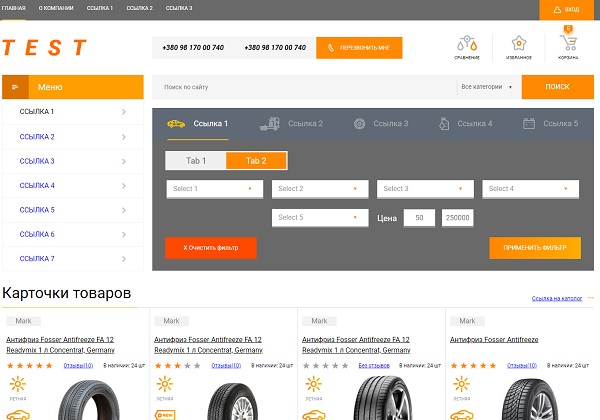

**Auto parts**
=================

This page is compliant with w3c standards, and is responsive.
The following technologies were used to create this page:
* HTML5
* CSS 3, Flexbox module, SASS
* JavaScript,
* Node.js, Gulp, Babel, Autoprefixer 
* Git,
* Photoshop

**Using and cloning a project**
----------------------------

1. You can clone the project or download the archive with the project.
2. The **/build** directory with **index.html** file contains a fully working project with all the necessary resources. The **index.html** file is the entry point. To start the page, you need to open **index.html** file in your browser.
3. The **/src** directory contains source files. If you want to work with source files, then you must have a **node.js**, **gulp.js** and **npm** installed. To install all dependencies, you need to go to the project root in the console (for example: **C:/Users/User/Desktop/roulette_game_js-master**) and run the command: ***npm i*** . Then we run the gulp task in the console: ***gulp watch*** . Then Gulp will track changes in source files and place processed files in the **/build** directory.